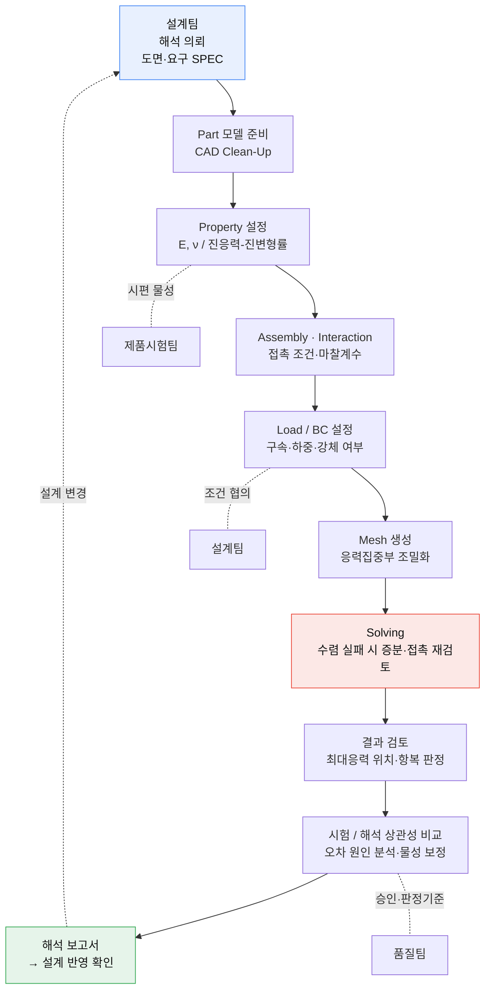

# CAE 구조해석 실무 — 해석 업무의 기초와 핵심

> Abaqus 기반 구조·기구 해석 실무 학습 기록 (4주 과정)
> 현직 구조해석 엔지니어 멘토링 · 코멘토 직무부트캠프
> 2026.07 ~ 2026.08 · 문은혁 (기계공학과 4학년)

---

## 이 저장소는

단순한 수강 기록이 아니라, **해석 결과를 "왜 그 값이 나왔는지" 설명할 수 있는 상태까지 끌고 간 과정**을 정리한 것이다.
4개의 과제를 수행하며 마주한 수렴 실패, 솔버 비정상 종료, 물리적으로 이상해 보이는 결과들을 각각 원인까지 추적했고,
그 판단 근거를 모두 문서로 남겼다.

| | 내용 |
|---|---|
| **도구** | Abaqus/CAE Learning Edition 2023 (Abaqus/Standard) |
| **단위계** | mm – N – MPa – tonne – s |
| **해석 유형** | 선형정적 · 접촉 비선형 · 준정적(Quasi-static) 기구 해석 |
| **다룬 것** | Shell/Solid 요소, 강체(Rigid body), 커넥터(Hinge·Translator), General contact, 강제변위 제어, 에너지 수지 검증 |

---

## 핵심 성과 4가지

### 1. 반력 0의 정체를 밝혀낸 것 — 오류가 아니라 물리였다

4주차 푸시버튼 기구 해석에서 JIG를 5 mm 눌렀는데 반력이 **RF3 = 2.77×10⁻¹⁸ N**, 사실상 0으로 나왔다.
같은 시점의 U3는 정확히 −5 mm였으므로 강제변위는 정상 적용된 상태였다.

→ **해석 오류가 아니라 기구학적으로 옳은 결과**로 판단했다.
모든 부품이 강체이고 커넥터가 이상적이면, 기구 내부에 저항 요소가 전혀 없으므로 준정적 조건에서 구동력이 필요 없다.
마찰(μ=0.15)이 있어도 마찰력은 수직항력에 비례하는데 그 수직항력 자체가 0에 수렴한다.

→ 실제 푸시버튼에 존재하는 **복귀 스프링(k = 1 N/mm)을 명시적 가정으로 도입**하고,
"반력은 이 가정에 선형 비례한다"는 것을 함께 밝혀 결과의 유효 범위를 정의했다.

**결과: 5 mm 조작에 필요한 힘 ≈ 8.17 N**

📄 [4주차 상세 보고서](projects/week4-pushbutton-mechanism/)

---

### 2. 결과를 믿기 전에 교차검증하는 습관

숫자 하나를 뽑고 끝내지 않고, 독립적인 두 가지 방법으로 검증했다.

| 검증 항목 | 방법 | 결과 | 판정 |
|---|---|---|---|
| **준정적 가정 타당성** | 운동에너지 / 외부일 비 (ALLKE/ALLWK) | 5×10⁻⁶ (0.0005 %) | 일반 기준 5 % 대비 4자리 여유 → 관성 영향 무시 가능 |
| **반력값 에너지 수지** | ALLWK ÷ 스트로크 = 23 N·mm ÷ 5 mm | 평균하중 4.6 N | 0→8.17 N 하중이력 곡선의 면적평균과 일치 |
| **커넥터 자유도 구속** | 참조점 회전성분 정량 판독 | BUTTON UR1 = −0.28 rad / UR3 ≈ 4×10⁻²¹ rad | Hinge가 허용축 외 회전을 완전 차단 |
| **커넥터 자유도 구속** | PIECE 1·2 UR3 | ≈ 10⁻²⁷ rad | Translator가 5자유도 정확히 구속 |

컨투어의 범위(+6.78 ~ −8.17 N)에는 지면 구속점 반력이 섞여 있으므로,
**답은 반드시 RP-JIG 절점값으로 읽어야 한다**는 것까지 구분해 기록했다.

---

### 3. 솔버 비정상 종료를 원인까지 추적

가장 오래 붙잡았던 실패는 수렴 부족이 아니라 **솔버 자체의 SEGMENTATION FAULT**였다.

```
Increment 57 → SEGMENTATION FAULT
```

원인: Step의 Solution technique이 **Quasi-Newton**이었고, 이 방식은 **Penalty 접촉과 병용할 수 없다.**
그 결과 72개 접촉요소가 강제로 Lagrange multiplier로 전환되며 발산·라인서치 축소를 반복하다 종료.

→ **Full Newton으로 변경 → 동일 모델이 126 증분 만에 완주.**

접촉이 지배적인 해석에서는 솔버 옵션 하나가 "결과의 정확도"가 아니라 **"결과의 존재 여부"** 를 결정한다는 것을 체감했다.

📄 [전체 트러블슈팅 기록 →](docs/03-troubleshooting-log.md)

---

### 4. 정량 근거를 붙인 설계 개선안

2주차 접촉 응력 과제에서 최대 응력이 항복 기준을 넘겼다.

| 평가 항목 | 값 | 기준 | 판정 |
|---|---|---|---|
| 최대 Von Mises 응력 | **393.5 MPa** | 250 MPa | ✗ 국부 항복 가능 |
| 발생 하중 (반력) | **205.8 N** | 개선 전후 동일 유지 | 비교 기준값 |
| 항복 기준 안전율 | **0.64** | 1.0 이상 | ✗ |

개선안을 "필렛을 키우자" 수준에서 멈추지 않고, **간이 이론으로 목표치를 먼저 계산**했다.

> 응력이 폭에 반비례한다고 보면 폭 2.0 → 3.2 mm 확대 시
> 393.5 × (2.0 / 3.2) ≈ **246 MPa** → 250 MPa 기준 만족 예상

동시에 **이 조건이 강제변위 제어라는 점**을 짚었다. 형상을 바꾸면 같은 −3 mm에서도 반력이 달라지므로,
개선 모델은 **RF ≈ 205.8 N이 되도록 맞춘 뒤 응력을 비교해야 한다**는 조건을 명시했다.

📄 [2주차 상세 보고서](projects/week2-contact-stress/)

---

## 해석 업무 프로세스 이해

1주차에 정리한 해석팀의 실제 업무 흐름. 해석은 혼자 돌리는 작업이 아니라 **설계·시험·품질팀과 물려 돌아가는 프로세스**다.



📄 [업무 절차 상세 (입·출력물, 팀 간 R&R) →](projects/week1-analysis-process/)

---

## 과제별 기록

| 주차 | 과제 | 해석 유형 | 핵심 결과 |
|---|---|---|---|
| **1주차** | [해석 업무 절차서 작성](projects/week1-analysis-process/) | — | 의뢰 → 보고까지 10단계, 팀 간 R&R 정의 |
| **2주차** | [Contact 응력 검토 및 저감안](projects/week2-contact-stress/) | Shell · 접촉 비선형 | σ_max 393.5 MPa / RF 205.8 N → 폭 확대 개선안 |
| **3주차** | [3점 굽힘 — 이론 vs 해석](projects/week3-three-point-bending/) | 탄소성 · 접촉 | 이론해 대비 오차 요인 정리 |
| **4주차** | [푸시버튼 기구 해석](projects/week4-pushbutton-mechanism/) | 강체 · 커넥터 · 준정적 | 조작력 8.17 N, 에너지 수지 검증 완료 |

## 이론 정리

| 문서 | 내용 |
|---|---|
| [00. 해석 담당자의 실제 업무](docs/00-analyst-role.md) | 주요 업무, 요구 역량, 직무 트렌드(무요소법) |
| [01. 유한요소해석 기초](docs/01-fea-fundamentals.md) | 강성·자유도·요소 선택·요소망 작성 지침 |
| [02. 재료 물성과 응력-변형률 선도](docs/02-stress-strain.md) | 공칭 vs 진응력, 소성 물성 입력 |
| [03. Abaqus 트러블슈팅 로그](docs/03-troubleshooting-log.md) | 실제로 막혔던 지점과 해결 근거 |

---

## 이 과정에서 얻은 것

- **결과를 의심하는 기준이 생겼다.** 이상해 보이는 값을 만나면 먼저 "이 값이 물리적으로 가능한가"를 따진다. 4주차의 반력 0이 그랬다.
- **가정을 숨기지 않는다.** 스프링 강성처럼 주어지지 않은 값은 가정으로 명시하고, 결과가 그 가정에 어떻게 의존하는지(선형 비례)까지 함께 쓴다.
- **제약을 설계 조건으로 다룬다.** Learning Edition의 1,000 노드 제한을 "못 하는 이유"가 아니라 요소 배분 문제로 바꿔, 접촉이 지배적인 곡면에 요소를 집중시켰다.
- **경계조건의 성격을 구분한다.** 하중 제어와 변위 제어는 개선안을 비교하는 방식 자체를 바꾼다.

---

## 저장소 구성

```
docs/         이론 정리 · 트러블슈팅 로그
projects/     주차별 과제 보고서 + 해석 결과 이미지
```

> 강의 교안, 과제 제공 CAD 파일(.stp/.igs) 등 교육기관 제작 자료는 포함하지 않았다.
> 본 저장소에는 직접 수행한 해석 결과와 작성 문서만 담았다.
