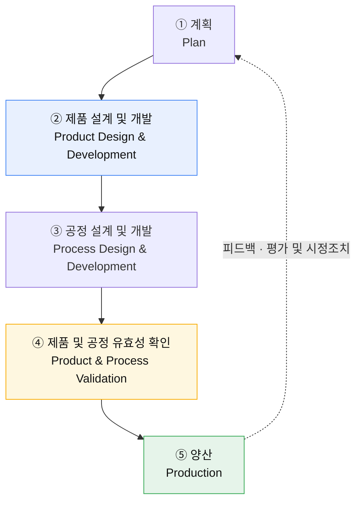

# 04. 부품개발 프로세스(APQP)와 해석 업무의 위치

> 강의 참고자료(부품개발 프로세스) 정리
> — 4주간 수행한 과제가 이 프로세스의 어디에 해당하는지 되짚어 본 기록

---

## 왜 이 문서를 따로 만들었나

1주차에 해석 업무 절차서를 쓸 때 내가 그린 범위는 **해석팀 안에서 벌어지는 일**이었다.
의뢰를 받아 모델을 만들고, 돌리고, 보고서를 쓰는 10단계.

과정을 마치고 부품개발 프로세스 자료를 다시 보니, 그 10단계 전체가
**부품개발이라는 더 큰 흐름의 한 칸**에 들어가 있었다.
해석 의뢰가 어느 시점에 왜 내려오는지, 내 보고서가 무엇을 통과시키는 근거가 되는지를
알고 쓰는 것과 모르고 쓰는 것은 다르다.

정리해 보니 **과제를 하면서 막혔던 것 중 일부는 해석 단계의 문제가 아니었다**는 걸 알게 됐다.
그 부분은 마지막 4절에 따로 적었다.

---

## 1. 전체 구조 — 5단계와 5개 게이트

부품개발은 5개의 승인 게이트로 끊기고, 그 사이를 5개 단계가 **겹쳐서** 흐른다.
앞 단계가 끝나야 다음이 시작하는 구조가 아니라는 점이 핵심이다.

| 단계 | ~개념 고안/승인 | ~프로그램 승인 | ~Prototype | ~PILOT | ~Launch | Launch 이후 |
|---|:---:|:---:|:---:|:---:|:---:|:---:|
| **① 계획** | ██ | ██ | | | | ██ |
| **② 제품 설계 및 개발** | | ██ | ██ | | | |
| **③ 공정 설계 및 개발** | | ██ | ██ | ██ | | |
| **④ 제품 및 공정 유효성 확인** | | | ██ | ██ | ██ | |
| **⑤ 양산** | | | | ██ | ██ | ██ |
| **피드백 · 평가 및 시정조치** | ██ | ██ | ██ | ██ | ██ | ██ |

게이트 구간별로 붙는 검증 활동의 이름은 다음과 같다.

| 구간 | 검증 활동 |
|---|---|
| 개념 고안/승인 ~ 프로그램 승인 | 프로그램 계획 및 정의 |
| 프로그램 승인 ~ Prototype | **제품설계 및 개발 검증** |
| Prototype ~ PILOT | 공정설계 및 개발 검증 |
| PILOT ~ Launch | 제품 및 공정 유효성 확인 |
| Launch 이후 | 피드백, 평가 및 시정조치 |

**구조해석이 근거를 대는 지점은 두 번째 구간 — "제품설계 및 개발 검증"** 이다.
즉 Prototype이 나오기 **전에** 판정을 끝내는 것이 이 업무의 존재 이유다.

---

## 2. 단계별 입력물과 출력물

이 프로세스의 문법은 단순하다. **앞 단계의 출력물이 그대로 다음 단계의 입력물이 된다.**
그래서 어느 한 단계에서 출력물이 비면, 그 공백은 사라지지 않고 뒤 단계로 그대로 넘어간다.

### ① 계획

> 고객의 요구와 기대를, **경쟁사보다 더 나은 제품을 제공한다는 관점에서 설계요구사항으로 변환**시켜 가는 과정

| 입력물 | 출력물 |
|---|---|
| 고객의 소리 | 설계목표 |
| 사업계획 / 마케팅전략 | **신뢰성 및 품질목표** |
| 제품 / 공정 B/M 자료 | 예비 BOM |
| 제품 / 공정 가정 | 예비 공정흐름도 |
| 제품 신뢰성 연구 | 특별제품 및 공정특성의 예비목록 |
| 고객입력물 | 제품보증계획 · 경영자지원 |

### ② 제품 설계 및 개발

> 설계특성이 최종형태로 개발되는 동안의 계획과정 요소를 설명
> - 시작품 제작 포함(목표에 대한 검증)
> - 일정목표와 기술적 요구사항을 충족함을 보장
> - 특별제품특성과 공정관리가 필요한 특성 선정

입력물은 ①단계의 출력물 전부다. 출력물은 주체에 따라 둘로 나뉜다.

| 설계활동에 의한 출력물 | 사전제품품질 계획팀에 의한 출력물 |
|---|---|
| 설계 FMEA | 신장비, 금형 및 설비 요구사항 |
| DFM & DFA | 특별제품 및 공정특성 |
| **설계검증 · 설계검토** | 시작 관리계획 |
| **시작품 제작** | 게이지 / 시험장비 요구사항 |
| 엔지니어링 도면 · 기술사양 · 재료사양 | 팀 타당성 확인 및 경영자 지원 |
| 도면 및 사양변경 | |

### ③ 공정 설계 및 개발

> 제조 시스템을 개발하는 주요특징과 제품을 생산하기 위한 관리계획을 논의한다.
> 효과적인 제조시스템의 개발을 보장하고, 이는 고객의 요구·필요·기대치를 충족시킴을 보장해야 한다.

| 입력물 | 출력물 |
|---|---|
| ②단계 출력물 전부 | 포장규격 · 포장사양 |
| | 품질시스템 검토 |
| | 공정흐름도 · 공정배치계획도 |
| | 특성매트릭스 · **PFMEA** |
| | 양산선행 관리계획 · 공정지침서 |
| | MSA 계획 · 초기공정능력조사계획 |

### ④ 제품 및 공정 유효성 확인

> 양산의 시행평가로 제조공정의 유효성을 평가한다.
> 양산시험가동 동안 품질계획팀은 관리계획과 공정흐름도가 실행되고,
> 고객의 요구에 일치한다는 것의 유효성이 나타나야 한다.

| 입력물 | 출력물 |
|---|---|
| ③단계 출력물 전부 | 양산시험 가동 · 양산관리 계획 |
| | 초기공정능력 조사 · 측정시스템 평가 |
| | **양산 유효성확인 시험** |
| | 양산 부품승인 · 포장 평가 |
| | 품질계획 완료확인 및 경영자 지원 |

### ⑤ 양산 (피드백 · 평가 및 시정조치)

> 산포의 모든 **이상원인과 우연원인**이 나타날 때 평가할 수 있어야 하고,
> 통계적 공정관리와 같은 조치가 취해져야 한다. 제품 품질계획의 효과 및 서비스를 평가한다.

| 입력물 | 출력물 |
|---|---|
| ④단계 출력물 전부 | 감소된 산포 |
| | 고객만족 |
| | 인도 및 서비스 |

---

## 3. 구조해석은 이 프로세스의 어디에 있나

해석 업무는 한 곳에 몰려 있지 않고 **세 지점에서 서로 다른 역할**로 등장한다.

| 단계 | 해석이 하는 일 | 대응하는 해석 담당자 업무 |
|---|---|---|
| **② 제품 설계 및 개발** | 설계검증 / 설계 FMEA의 근거 제공. **시작품을 만들기 전에** SPEC 만족 여부를 판정 | 사전 성능 해석 |
| **④ 제품 및 공정 유효성 확인** | 양산 유효성확인 **시험 결과와 해석의 상관성 분석**, 오차 원인 규명·물성 보정 | 시험/해석 상관성 분석 |
| **⑤ 양산 · 피드백** | 필드 품질 문제 발생 시 **현상 재현** → 설계 변경 DATA 확보 → 개선 효과 검증 | 품질 문제 해결 |

②단계에 걸린 값이 가장 크다. 여기서 걸러내지 못한 문제는
③단계에서 금형·설비 요구사항으로 굳고, ④단계에서는 이미 양산 시험가동이 돌아간 뒤다.
**출도 전에 판정을 끝내는 것**이 해석의 값어치라는 말의 의미가 이 그림에서 분명해진다.

한편 ④단계와 ⑤단계에서 나온 결과는 **재료 물성 DB와 해석 결과 DB로 회수**되어
다음 프로그램의 ①·②단계 입력물이 된다.
[해석 업무 표준화와 물성 DB화](00-analyst-role.md)가 왜 해석팀의 고유 업무로 잡혀 있는지가 여기서 설명된다.

---

## 4. 과제를 하면서 막혔던 것 중, 해석 문제가 아니었던 것

### (1) 2주차의 "250 MPa냐 850 MPa냐"는 상류 입력의 공백이었다

2주차 접촉 응력 과제에서 재료 데이터에 250 MPa와 850 MPa 두 값이 주어졌고,
어느 쪽을 판정 기준으로 삼느냐에 따라 안전율이 **0.64와 2.16으로 갈렸다.**
당시에는 "실무에서는 항복 발생 여부를 먼저 본다"는 근거로 250 MPa를 택하고 그 판단을 보고서에 명시했다.

프로세스 관점에서 다시 보면, 그 판정 기준은 원래 **①단계 계획의 출력물인
"설계목표"와 "신뢰성 및 품질목표"로 내려왔어야 할 값**이다.
해석 담당자가 고를 문제가 아니라, 프로그램 승인 시점에 이미 정해져 있어야 하는 값이었다.

→ 즉 그때의 혼란은 해석 실력의 문제가 아니라 **상류 입력물이 비어 있었기 때문**이고,
1주차 절차서에서 "①번 단계에 판정 기준을 사전 정의한다"를 넣은 것이 정확히 이 공백을 막는 장치였다.

### (2) 해석과 시험 사이의 시차는 구조적으로 발생한다

1주차 절차서를 쓰면서 "⑨ 상관성 비교만 실행 시기가 다르다(시험 샘플 확보 후)"고 적었는데,
그때는 단순히 시험이 오래 걸려서라고만 이해했다.

APQP 위에 올려 보면 이유가 더 분명하다.

- 해석(설계검증)은 **②단계 — Prototype 이전**
- 시험 유효성 확인은 **④단계 — PILOT ~ Launch 구간**

두 활동은 애초에 **다른 게이트 구간에 배치된 별개의 활동**이다.
일정이 밀려서 생기는 시차가 아니라 프로세스가 그렇게 설계되어 있는 것이고,
그래서 ②단계의 해석 결과는 **시험으로 확인받기 전에 이미 설계를 움직인다.**

→ 상관성 검증으로 사후 보정할 수 있다는 전제에 기대면 안 되고,
**해석 자체의 신뢰도를 그 시점에 스스로 확보해 둬야 한다**는 뜻이 된다.
4주차에서 반력 0을 만났을 때 에너지 수지(ALLKE/ALLWK)와 커넥터 자유도를 따로 교차검증한 것,
가정한 스프링 강성을 명시하고 결과가 그 가정에 선형 비례한다는 것까지 밝힌 것이
결국 이 시차를 견디기 위한 작업이었다고 이해했다.

### (3) "피드백·평가 및 시정조치"가 전 구간에 깔려 있는 이유

이 띠 하나만 5단계 전체를 가로지른다.
해석 쪽으로 옮기면, 3주차에서 이론해와 해석값의 오차 요인을 정리한 것이나
[트러블슈팅 로그](03-troubleshooting-log.md)에 실패 원인을 남긴 것이
개인 학습 기록이 아니라 **프로세스가 요구하는 활동**에 해당한다는 뜻이다.

Quasi-Newton과 Penalty 접촉을 병용할 수 없다는 것을 한 번 기록해 두면
다음 사람이 SEGMENTATION FAULT에서 하루를 쓰지 않는다.
표준 매뉴얼과 DB화가 해석팀 업무로 잡혀 있는 이유가 이것이라고 본다.

---

## 관련 문서

- [00. 해석 담당자의 실제 업무](00-analyst-role.md) — 해석팀 내부 업무 6가지 축
- [1주차 — 해석 업무 절차서](../projects/week1-analysis-process/) — 해석 수행 절차 상세 및 팀 간 R&R
- [03. Abaqus 트러블슈팅 로그](03-troubleshooting-log.md) — 시정조치 기록
