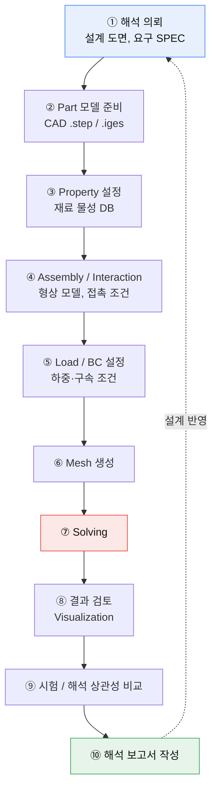

# 1주차 — 해석 업무 절차서 작성

> **과제**: 해석 업무 절차를 도식화하고, 각 단계의 입·출력물과 상세 내용을 정의할 것

---

## 과제의 의도

첫 주차에 Abaqus를 켜지 않고 절차서부터 쓰게 한 이유가 있다고 본다.
해석은 **혼자 돌리는 작업이 아니라 설계·시험·품질팀과 물려 돌아가는 프로세스**이고,
"어떤 입력물을 누구에게 받아 어떤 출력물을 누구에게 넘기는가"를 모르면
결과가 아무리 정확해도 업무가 되지 않는다.

---

## 업무 절차 도식

---

## 단계별 입·출력물 및 상세

| # | 업무 절차 | 입력물 | 출력물 | 상세 내용 |
|---|---|---|---|---|
| ① | **해석 의뢰** | 설계 도면, 요구 SPEC | 해석 요청서 | 해석 항목 및 고객/자체 SPEC 만족 기준을 **사전에 명확히 정의**하여 해석 방향을 설정한다 |
| ② | **Part 모델 준비** | CAD 파일 (.step/.iges) | 해석용 형상 모델 | CAD 형상의 불필요한 피처를 제거(Clean-Up)하여 해석에 적합한 형상으로 단순화한다 |
| ③ | **Property 설정** | 재료 물성 DB (E, ν, 응력-변형률 곡선) | 재료 섹션 정의 파일 | 탄성계수·포아송비를 기본으로 입력하며, **소성 거동이 예상될 경우 진응력-진변형률 곡선을 추가 정의**한다 |
| ④ | **Assembly / Interaction** | 형상 모델, 접촉 조건 | 어셈블리 파일 | 파트 간 위치 관계를 정의하고, 접촉 발생 부위에 마찰계수 등 접촉 조건을 설정한다 |
| ⑤ | **Load / BC 설정** | 하중 조건, 구속 조건 | 해석 Input Deck | 구속 조건(U1~UR3)과 하중 또는 강제 변위를 **실제 사용 환경에 맞게** 적용하며, 강체 설정 여부도 함께 검토한다 |
| ⑥ | **Mesh 생성** | 해석용 형상 모델 | 메쉬 파일 | **응력집중이 예상되는 부위는 조밀한 요소망**을 적용하고, 솔리드는 육면체, 박판은 쉘 요소를 우선 사용한다 |
| ⑦ | **Solving** | Input Deck + 메쉬 | 결과 파일 (.odb) | 해석 Job을 생성·실행하며, **수렴성 오류 발생 시 하중 증분 수 또는 접촉 조건을 재검토**한다 |
| ⑧ | **결과 검토** | 결과 파일 | 응력/변형 분포 이미지 | 최대 응력 발생 위치와 변형량을 확인하고, **항복응력 대비 안전 여부**를 판단한다 |
| ⑨ | **시험 / 해석 상관성 비교** | 해석 결과 + 시험 데이터 | 오차 분석 보고서 | 시험 결과와 비교하여 오차 원인을 분석하고, 필요 시 **물성 또는 경계조건을 보정**한다 |
| ⑩ | **해석 보고서 작성** | 전 단계 결과물 | 해석 보고서 | 해석 조건·결과·개선 방향을 포함한 보고서를 작성해 설계 담당자에게 전달하고 **설계 반영 여부를 확인**한다 |

---

## 팀 간 R&R

**● 주관** (해당 팀이 수행) · **○ 협조/참여** · **→ ←** 전달 방향

| # | 업무 절차 | 설계팀 | 해석팀 | 제품시험팀 | 품질팀 | 실행 주기 / 시기 |
|---|---|:---:|:---:|:---:|:---:|---|
| ① | 해석 의뢰 | → 의뢰 | ← 접수 | | | 설계 변경 또는 신규 개발 착수 시 |
| ② | Part 모델 준비 | → 형상 전달 | ← Clean-Up | | | 의뢰 접수 후 순차 |
| ③ | Property 설정 | | **●** | ← 시편 물성 제공 | | 모델 준비 후 순차 |
| ④ | Assembly / Interaction | | **●** | | | Property 설정 후 순차 |
| ⑤ | Load / BC 설정 | ← 조건 협의 | **●** | | ← 기준 검토 | Assembly 후 순차 |
| ⑥ | Mesh 생성 | | **●** | | | BC 설정 후 순차 |
| ⑦ | Solving | | **●** | | | Mesh 완료 후 순차 |
| ⑧ | 결과 검토 | ← 결과 공유 | **●** | | ← 판정 기준 적용 | Solving 후 순차 |
| ⑨ | 시험 / 해석 상관성 비교 | | ○ 협조 | **●** | ← 승인 | **시험 샘플 확보 후** |
| ⑩ | 해석 보고서 작성 | ← 설계 반영 | **●** | | ← 최종 검토 | 해석 및 상관성 검토 완료 후 |

---

## 절차서를 쓰면서 정리된 것

### 1. ①번 단계가 전체를 좌우한다
"해석 항목 및 SPEC 만족 기준을 **사전에** 명확히 정의"를 첫 단계에 넣은 이유는,
판정 기준이 정해지지 않은 상태에서 해석하면 결과가 나와도 **OK/NG를 말할 수 없기** 때문이다.

> 실제로 2주차 과제에서 이 문제를 만났다.
> 재료 데이터에 250 MPa와 850 MPa 두 값이 주어졌는데,
> **어느 쪽을 판정 기준으로 삼느냐에 따라 안전율이 0.64와 2.16으로 갈렸다.**
> 결국 "실무 설계 검토에서는 항복 발생 여부를 먼저 본다"는 근거로 250 MPa를 택했고,
> 그 판단 근거를 보고서에 명시했다.
> → [2주차 보고서](../week2-contact-stress/)

### 2. ⑤번과 ⑨번에만 다른 팀이 개입한다
- **⑤ Load / BC** — 설계팀과 조건 협의, 품질팀 기준 검토
- **⑨ 상관성 비교** — 시험팀 주관, 품질팀 승인

해석팀이 단독으로 결정하면 안 되는 지점이 **"실제 사용 환경을 무엇으로 볼 것인가"** 와
**"해석과 시험이 안 맞을 때 무엇을 믿을 것인가"** 라는 뜻이다.
둘 다 기술 문제가 아니라 합의의 문제다.

### 3. ⑨번만 실행 시기가 다르다
①~⑧은 "순차 진행"이지만 ⑨는 **"시험 샘플 확보 후"** 다.
해석은 시험보다 훨씬 빨리 끝나므로, 상관성 검증은 항상 뒤로 밀린다.
그래서 ⑧에서 나온 결과로 설계가 먼저 움직이고, ⑨에서 사후 보정하는 구조가 된다.
**이 시차가 해석 결과의 신뢰도를 미리 확보해두어야 하는 이유**라고 이해했다.

---

## 관련 문서

- [00. 해석 담당자의 실제 업무](../../docs/00-analyst-role.md)
