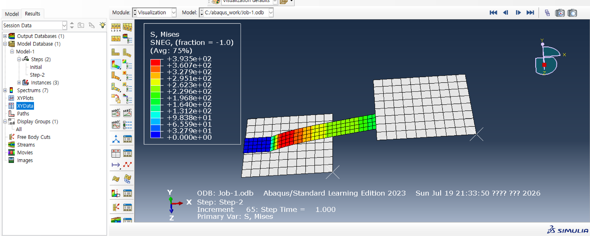
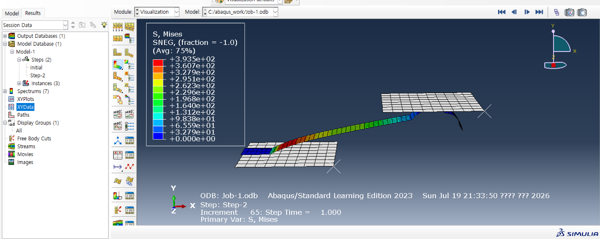
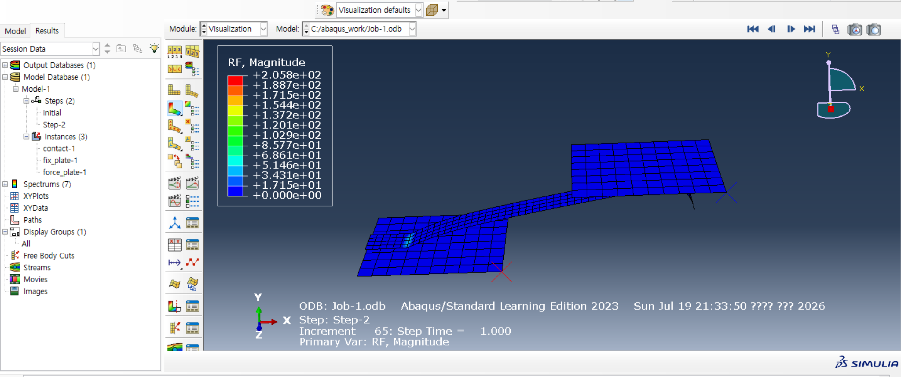

# 2주차 — Contact 최대응력·발생하중 검토 및 응력 저감 방안

> **과제**
> ① Contact에 발생되는 최대응력 및 하중을 검토할 것
> ② **발생 하중은 그대로 유지하면서** Contact에 발생되는 응력을 낮출 수 있는 방안을 제시할 것

`Abaqus/CAE Learning Edition 2023 (Abaqus/Standard)` · 단위계 `mm–N–MPa–tonne–s`

---

## 결론 먼저

| 구분 | 해석 결과 | 판정 |
|---|---|---|
| **최대 응력** | S, Mises = 3.935e+02 MPa ≈ **393.5 MPa** | 250 MPa 기준 초과 → **국부 항복 가능성** |
| **발생 하중** | RF, Magnitude = 2.058e+02 N ≈ **205.8 N** | Force plate의 U2 = −3 mm 강제변위에 의한 반력 |
| **최종 판단** | 응력 집중부에서 과응력 발생 | 동일 하중(≈205.8 N) 유지하며 **단면 폭 / 필렛 / 보강 형상 개선 필요** |

---

## 1. 해석 조건

| 항목 | 입력값 / 조건 |
|---|---|
| **Contact 설계 변수** | Circle center H_dir = 20 mm, V_dir = 5 mm, Radius = 3 mm, H_dir_Length = 3 mm, **폭 = 2 mm** |
| **구속 조건** | Fix plate: U1, U2, U3, UR1, UR2, UR3 구속 |
| **하중 조건** | Force plate: U1, U3, UR1, UR2, UR3 구속 / **U2 = −3 mm 강제변위** |
| **접촉 조건** | 마찰계수 0.15, 지정 표시부 6자유도 전부 구속 |
| **재료 / 요소** | Shell 속성, 두께 0.6 mm |
| **재료 상수** | E = 200 GPa, ν = 0.29 |
| **소성 데이터** | 250 MPa @ strain 0 → 850 MPa @ strain 0.06 |

Fix plate와 Force plate는 강체로 설정했다.

---

## 2. 해석 결과

### 2.1 최대 응력

*S, Mises 최대 3.935e+02 MPa (SNEG, fraction = −1.0)*

최대 Von Mises 응력은 **393.5 MPa**.
응력은 Contact의 **좁은 연결부(neck)** 와 **변형이 크게 발생하는 곡률 전환부**에 집중된다.

*변형 형상 측면 확인 — 응력 집중 위치*

### 2.2 발생 하중

*RF, Magnitude 최대 2.058e+02 N*

발생 하중은 RF Magnitude 기준 최대 **205.8 N**.

> ⚠️ **이 값의 성격이 중요하다.**
> 본 과제는 힘을 직접 입력한 것이 아니라 Force plate에 **U2 = −3 mm를 부여한 변위 제어 해석**이다.
> 따라서 205.8 N은 가해진 힘이 아니라 **구조물이 해당 변위에 저항하면서 만들어낸 반력**이다.
> 이 구분이 4절의 개선안 비교 방법을 결정한다.

---

## 3. 판정

| 평가 항목 | 값 | 기준 | 판정 |
|---|---|---|---|
| 최대 응력 | 393.5 MPa | 250 MPa | ✗ **불만족** — 국부 항복 가능 |
| 발생 하중 | 205.8 N | 동일 하중 유지 목표 | 개선안 비교 기준값으로 사용 |
| 항복 기준 안전율 | **0.64** | 1.0 이상 권장 | ✗ **불만족** |
| 고응력 위치 | 좁은 neck / 곡률 전환부 | 응력 집중 최소화 | 형상 개선 필요 |

### 판정 기준을 250 MPa로 잡은 이유

재료 데이터에 두 개의 값이 주어져 어느 쪽을 기준으로 삼느냐에 따라 결론이 갈렸다.

| 기준 | 안전율 | 해석 |
|---|---|---|
| **250 MPa** (strain 0 → 항복응력) | 250 / 393.5 = **0.64** | 항복 발생 |
| 850 MPa (strain 0.06 지점) | 850 / 393.5 = **2.16** | 여유 있음 |

→ **실무적인 설계 검토에서는 항복 발생 여부를 먼저 보는 것이 타당**하므로 250 MPa를 기준으로 판정했다.
소성이 시작되면 형상이 영구 변형되어 접촉 부품으로서의 기능(복원력)을 잃기 때문이다.

---

## 4. 응력 저감 방안

### 4.1 접근 방향

발생 하중을 약 **205.8 N으로 유지**하고, 동일 하중 조건에서
Contact의 **단면계수와 곡률 연속성을 키우는** 방향으로 개선한다.

> **단, 비교 조건에 함정이 있다.**
> 현재 해석은 강제변위 조건이므로, 형상을 변경한 뒤 U2 = −3 mm를 **그대로 유지하면 반력이 달라진다.**
> 형상을 강화하면 같은 변위에서 반력이 오히려 커지기 때문이다.
>
> → 따라서 개선 모델은 **RF가 약 205.8 N이 되도록 동일 하중 조건 또는 변위 재조정 조건에서 비교**해야 한다.
> 과제가 요구한 "발생 하중은 그대로 유지"를 만족시키려면 이 조건 정렬이 선행되어야 한다.

### 4.2 개선안 우선순위

| 우선순위 | 개선 방안 | 기대 효과 | 검증 기준 |
|:---:|---|---|---|
| **1** | Contact 폭 **2 mm → 3.0~3.2 mm 이상** 확대 | 유효 단면적·단면계수 증가 → neck부 응력 크게 감소 | RF ≈ 205.8 N 유지, **S_Mises < 250 MPa** |
| **2** | 곡률 전환부 **필렛 R 확대**, 직선-곡선 연결부를 완만한 테이퍼로 변경 | 응력집중계수 $K_t$ 감소, 국부 고응력대 완화 | 최대응력 위치 완화 및 고응력 영역 분산 확인 |
| **3** | 고정/접촉부 주변에 **국부 보강 패드 또는 bead** 추가 | 굽힘 강성 증가, 접촉부 근처 국부 변형 감소 | 하중 동일 조건에서 응력·변위 감소 확인 |
| **4** | 고응력부 **mesh 세분화 후 재해석** | 수치적 피크인지 실제 응력집중인지 구분 | **메시 독립성 검토 후** 최종값 채택 |

### 4.3 1순위 개선안의 정량 근거

응력이 폭에 반비례한다고 보는 간이 추정:

$$\sigma_{new} \approx 393.5 \times \frac{2.0}{3.2} \approx \mathbf{246\ MPa}$$

→ 250 MPa 기준을 만족할 것으로 예상된다.

> 다만 실제 Abaqus 결과는 **접촉 비선형, 굽힘, 경계조건의 영향**으로 달라지므로
> 반드시 재해석으로 확인해야 한다.
> 이 추정은 "폭을 얼마나 늘려야 하는가"의 **출발점을 정하기 위한 것**이지 결론이 아니다.

---

## 5. 결론

1. Contact에 발생한 최대 Von Mises 응력은 **393.5 MPa**, Force plate에 U2 = −3 mm를 부여했을 때의 최대 반력은 **205.8 N**이다.
2. 재료 데이터의 **250 MPa 항복 기준을 초과**하므로 현재 Contact 형상에서는 국부 항복이 발생할 가능성이 있다. (안전율 0.64)
3. 응력 집중은 **폭 2 mm의 좁은 연결부**와 **곡률이 급격히 변하는 부위**에서 발생한 것으로 판단된다.
4. 발생 하중 205.8 N 수준은 유지하되, **폭을 3.0~3.2 mm 이상으로 확대**하고 **곡률 전환부 필렛을 확대**, 필요 시 국부 보강 형상을 추가하는 개선안이 타당하다.
5. 개선 후에는 **동일 RF 수준에서 최대응력이 250 MPa 이하로 감소하는지 재해석으로 검증**한다.

---

## 이 과제에서 배운 것

- **변위 제어와 하중 제어는 개선안을 비교하는 방법 자체를 바꾼다.** "하중을 유지하라"는 조건을 만족시키려면 강제변위를 그대로 두면 안 된다.
- **판정 기준을 고르는 것도 해석자의 일이다.** 250 vs 850 MPa 중 무엇을 기준으로 삼느냐에 따라 합격/불합격이 뒤집혔고, 그 선택의 근거를 남겨야 결과가 설득력을 가진다.
- **개선안에는 검증 기준이 붙어야 한다.** "필렛을 키운다"까지는 누구나 말할 수 있지만, "RF 205.8 N 유지 조건에서 250 MPa 이하"라는 합격선이 있어야 실행 가능한 제안이 된다.

---

## 관련 문서

- [02. 재료 물성과 응력-변형률 선도](../../docs/02-stress-strain.md)
- [01. 유한요소해석 기초 — 변위 제어 해석 읽는 법](../../docs/01-fea-fundamentals.md)
