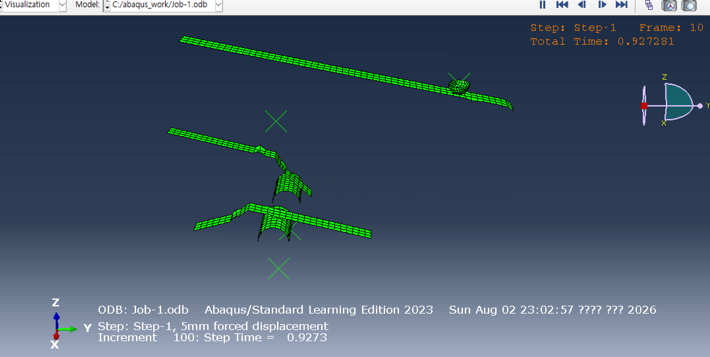
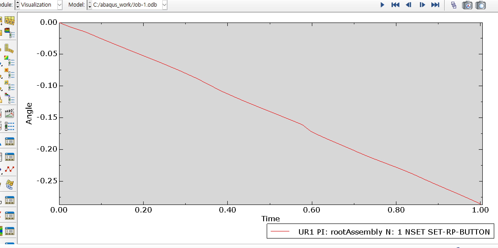
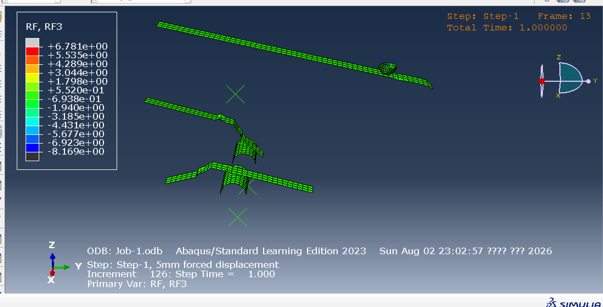
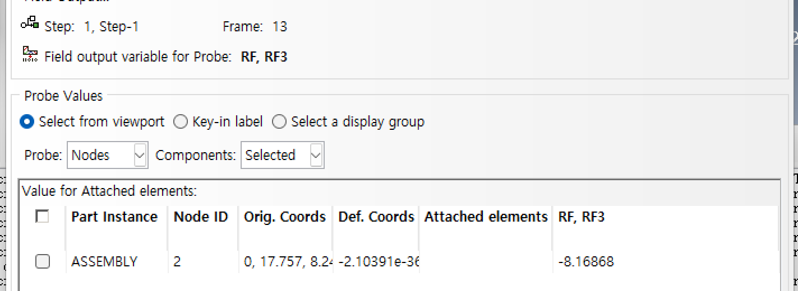
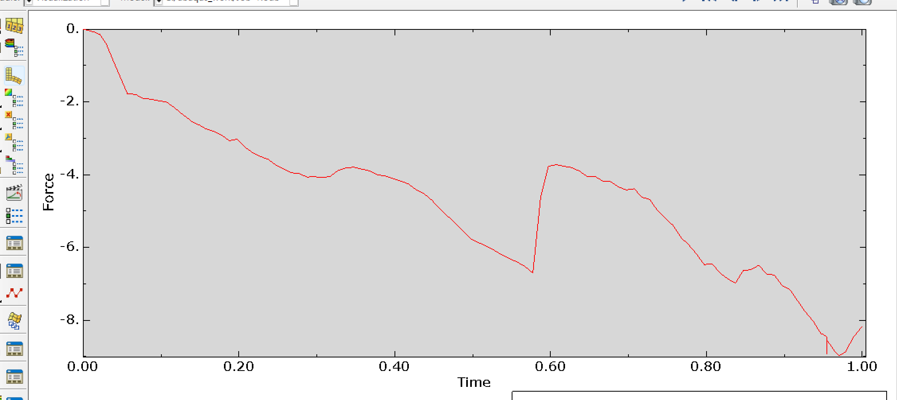
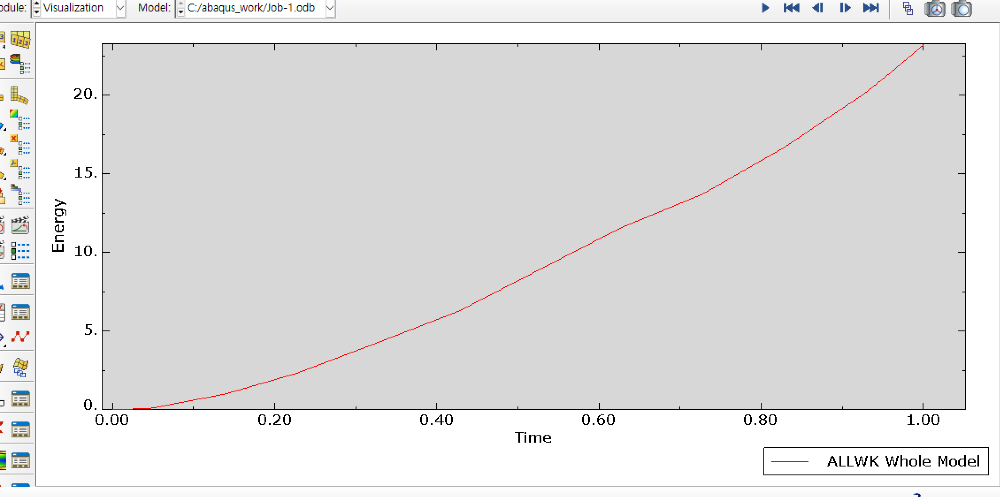
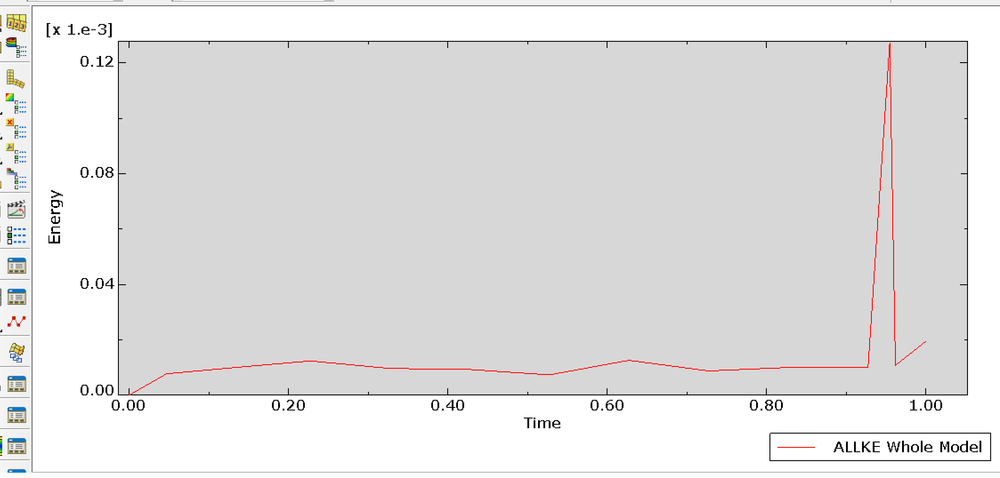

# 4주차 — 푸시버튼 기구의 JIG 강제변위에 따른 발생 하중 해석

> **과제**: JIG에 강제 변위(5 mm) 입력 시 발생되는 하중을 검토할 것

`Abaqus/CAE Learning Edition 2023 (Abaqus/Standard)` · 단위계 `mm–N–MPa–tonne–s`

---

## 결론 먼저

| # | 결론 |
|:---:|---|
| **1** | JIG에 5 mm 강제변위 입력 시 발생 하중 **RF3 = −8.16868 N**, 즉 크기 약 **8.17 N** (−Z 방향) |
| **2** | 단, 이 값은 PIECE 복귀 스프링 강성 **k = 1 N/mm 가정**에 기반하며, 반력은 이 가정값에 **선형 비례**한다 |
| **3** | 저항 요소가 없는 이상적 강체 기구에서는 **반력이 0으로 산출되는 것이 물리적으로 옳다.** 실제 조작력 예측에는 저항 조건 부여가 필수 |
| **4** | BUTTON은 X축 중심 회전만(UR1 ≈ −0.28 rad, UR3 ≈ 0), PIECE 1·2는 회전이 완전 구속(UR3 ≈ 0) → **Hinge·Translator 커넥터가 의도대로 작동함을 검증** |
| **5** | **ALLKE/ALLWK ≈ 5×10⁻⁶** 로 관성 효과가 무시할 수준 → 준정적 가정 타당. 평균 하중(4.6 N)이 에너지 수지와 일치하여 결과 신뢰성 확인 |

---

## 1. 과제 개요

### 1.1 제시된 작업 순서

| 순서 | 작업 내용 |
|:---:|---|
| ① | 참조 POINT 생성 (BUTTON 회전 중심, JIG, PIECE 1, PIECE 2) |
| ② | 각 파트 강체(Rigid) BODY 생성 |
| ③ | BUTTON 회전 중심 참조 Pt에 **Hinge** 커넥터 생성 |
| ④ | PIECE 1 참조 Pt에 **Translator** 커넥터 생성 |
| ⑤ | PIECE 2 참조 Pt에 **Translator** 커넥터 생성 |

### 1.2 해석의 성격 — 3주차와 무엇이 다른가

| | 3주차 (3점 굽힘) | **4주차 (본 과제)** |
|---|---|---|
| 대상 | 변형체 | **전 부품 강체** |
| 자유도 정의 | 요소의 절점 | **커넥터로 기구학적 자유도 정의** |
| 관심 결과 | 응력 | **JIG 참조점의 반력(RF)** |
| 해석 유형 | 구조해석 | **기구(mechanism) 해석** |

즉 이 과제가 묻는 것은 응력이 아니라 **"JIG를 5 mm 눌러 내리는 데 필요한 조작력"** 이다.

본 모델은 버튼을 누르면 BUTTON이 힌지를 중심으로 회전하고,
그 **캠면이 좌우 PIECE를 밀어내는 푸시버튼 래치 구조**에 해당한다.

| 명칭 | 매커니즘 |
|---|---|
| BUTTON | 회전운동 |
| PIECE 1 | 직선운동 |
| PIECE 2 | 직선운동 |
| JIG | 강제변위 입력 |

---

## 2. 해석 모델 구성

### 2.1 형상 및 임포트

BUTTON, JIG, PIECE 1, PIECE 2 총 **4개의 IGES 파일**을 임포트했다.

- 4개 파일 모두 Solid 엔티티가 없는 **면(Surface) 데이터** → Topology를 **Shell**로 지정, **Stitch edges** 옵션 적용
- 4개 파일이 **동일한 CAD 좌표계를 공유**하므로 별도의 이동·회전 없이 조립 위치가 그대로 일치
- 강체로 사용할 것이므로 임포트 시 발생하는 **미봉합 모서리 경고는 결과에 영향을 주지 않음**

### 2.2 참조점 및 강체 정의

과제가 지정한 좌표에 참조점을 생성하고, `Constraint > Rigid body`(Body 영역)로 각 인스턴스 전체를 참조점에 묶었다.
이로써 각 부품의 거동은 **참조점의 6자유도만으로 결정**된다.

| 참조점 | 좌표 (X, Y, Z) [mm] | 역할 |
|---|---|---|
| **RP-BUTTON** | (0, 0, 0) | BUTTON 회전 중심 / Hinge 커넥터 부착점 |
| **RP-JIG** | (0, 17.757, 8.248) | **강제변위 입력점 · 반력 측정점** |
| **RP-PIECE1** | (−6.1, 0, −12.65) | PIECE 1 / Translator 커넥터 부착점 |
| **RP-PIECE2** | (6.1, 0, −12.65) | PIECE 2 / Translator 커넥터 부착점 |

### 2.3 커넥터 정의 — 본 과제의 핵심 단계

**커넥터는 두 점 사이에 정의되는 요소**다.
따라서 각 부품 참조점과 짝을 이루는 **지면(ground) 참조점 3개를 추가 생성**하여 Wire로 연결한 뒤 **Encastre로 완전 구속**했다.
이렇게 해야 "고정된 지면 기준으로 특정 자유도만 허용"이라는 과제 요구를 정확히 구현할 수 있다.

> 지면 참조점은 부품 참조점과 좌표가 겹쳐 화면에서 선택이 어려우므로 **X방향으로 충분히 이격** 배치했다.

| 커넥터 섹션 | 연결 대상 | 타입 | 로컬 1축 |
|---|---|---|---|
| **CONN-HINGE** | RP-BUTTON ↔ 지면 | Join + Revolute | 전역 X (전역좌표계) |
| **CONN-TRANS** | RP-PIECE1 ↔ 지면 | Translator | 전역 Z (CSYS-TRANS) |
| **CONN-TRANS** | RP-PIECE2 ↔ 지면 | Translator | 전역 Z (CSYS-TRANS) |

Abaqus에서 **Hinge는 로컬 1축 중심의 회전만**, **Translator는 로컬 1축 방향의 병진만** 허용한다.

Translator의 로컬 1축을 전역 Z에 맞추기 위해 **Datum CSYS(CSYS-TRANS)** 를 3 Points 방식으로 생성해
Section Assignment의 **Orientation**에 지정했다.

| 지정 | 좌표 |
|---|---|
| 원점 | (0, 0, 0) |
| X축상의 점 | (0, 0, 10) |
| XY평면상의 점 | (10, 0, 0) |

> ⚠️ **커넥터의 로컬 1축 방향을 잘못 지정하면 기구가 전혀 다른 방식으로 움직인다.**
> 이 단계가 본 과제에서 가장 주의를 요하는 부분이었다.

### 2.4 접촉 · 경계조건 · 해석 스텝

| 항목 | 설정 내용 |
|---|---|
| **접촉** | General contact (Standard), All* with self / Normal: Hard contact, 분리 허용 / Tangential: Penalty, μ = 0.15 |
| **BC-GROUND** | 지면 참조점 3개, Initial step, ENCASTRE (U1=U2=U3=UR1=UR2=UR3=0) |
| **BC-JIG-DISP** | RP-JIG, Step-1, U1=U2=0, **U3 = −5 mm**, UR1=UR2=UR3=0 (Ramp) |
| **해석 스텝** | **Dynamic, Implicit** / Application: **Quasi-static** / Time period = 1 / **Nlgeom: On** |
| **증분 제어** | Automatic — Initial 0.01, Minimum 1E−12, Maximum 0.05, 최대 증분수 10,000 |
| **솔버** | Solution technique: **Full Newton** |
| **점질량** | 부품 참조점 1E−4 t, 지면 참조점 1E−6 t (수치 안정화 목적) |
| **메쉬** | Learning Edition 1,000 노드 제한에 맞춰 배분. 접촉이 지배적인 JIG 곡면에 요소 집중 (원주당 20개 이상 확보) |

#### 왜 Static이 아니라 Dynamic, Implicit인가

4개 부품이 모두 강체이고 저항 요소가 없으면 **정적 해석은 특이(singular)해지기 쉽다.**
접촉이 순간적으로 분리되면 부품이 자유 부유하기 때문이다.

→ 이를 **관성으로 정규화**하기 위해 `Static, General` 대신 `Dynamic, Implicit`의 **Quasi-static** 옵션을 사용했다.
관성이 결과를 오염시키지 않았는지는 [4.4절 에너지 검증](#44-준정적-가정의-타당성-검증)에서 확인했다.

---

## 3. 해석 수행 과정 및 주요 이슈

최종 결과를 얻기까지 여러 차례의 수렴 실패와 솔버 중단을 겪었다.

| 증상 | 원인 | 조치 |
|---|---|---|
| `Too many attempts needed` (수렴 실패) | 반경 1 mm JIG 반원통의 원주 분할이 **8개**에 불과해 접촉 판정이 반복 반전(채터링) | Seed의 deviation factor를 낮춰 **원주당 요소 20개 이상** 확보 |
| 노드 수 초과 경고 | Learning Edition의 1,000 노드 제한 | 부품별 요소 수 재배분 → **총 700개 내외** |
| 커넥터 노드에 질량 없음 경고 (zero pivot 위험) | 강체 참조점에 질량 미정의 | `Special > Inertia`로 각 참조점에 **미소 점질량** 부여 |
| **Increment 57에서 `SEGMENTATION FAULT`** | Solution technique이 **Quasi-Newton**이었고, 이는 **Penalty 접촉과 병용 불가** → 72개 접촉요소가 강제로 Lagrange multiplier로 전환되며 발산 | **Full Newton으로 변경 → 126 증분 만에 완주** |
| RF3 ≈ 2.77×10⁻¹⁸ N (사실상 0) | 기구 내 저항 요소 부재 | Translator 커넥터에 **복귀 스프링(Elasticity)** 부여 → [3.1절](#31-저항-요소의-도입과-그-근거) |

📄 각 항목의 상세 진단 과정: [03. 트러블슈팅 로그](../../docs/03-troubleshooting-log.md)

### 3.1 저항 요소의 도입과 그 근거

초기 모델에서는 JIG를 5 mm 눌렀음에도 반력이 **RF3 = 2.77×10⁻¹⁸ N**, 즉 사실상 0으로 산출되었다.

**먼저 확인한 것**: 같은 시점의 **U3가 정확히 −5 mm** 였다.
→ 강제변위는 정상적으로 적용된 상태였다. 즉 BC 설정 실수가 아니다.

**따라서 이는 해석 오류가 아니라 물리적으로 옳은 결과라고 판단했다.**

```
BUTTON  : 힌지를 중심으로 자유롭게 회전
PIECE   : Translator를 따라 자유롭게 미끄러짐
전 부품 : 강체 → 변형 에너지 없음
──────────────────────────────────────
기구 내부에 저항하는 요소가 전혀 없음
→ 준정적 조건에서 구동력이 필요하지 않음
```

마찰(μ = 0.15)이 정의되어 있으나, **마찰력은 수직항력에 비례**하고
그 **수직항력 자체가 0에 수렴**하므로 마찰 저항 역시 0이 된다.

**조치**: 실제 푸시버튼 구조에는 PIECE를 원위치로 되돌리는 **복귀 스프링**이 존재한다.
과제 조건에 스프링 강성이 명시되어 있지 않으므로,
Translator 커넥터(CONN-TRANS)에 **Elasticity를 부여하여 복귀 스프링 강성 k = 1 N/mm를 가정**했다.

> **후술하는 반력값은 이 가정에 선형 비례한다.**
> 실제 설계값이 확정되면 비례 스케일로 즉시 환산할 수 있다.

---

## 4. 해석 결과

Job은 **Increment 126, Step Time = 1.000** 으로 정상 완주했으며, 5 mm 강제변위 구간 전체가 해석되었다.

### 4.1 기구 거동 검증


*강제변위에 따른 기구 거동 — JIG 하강 → BUTTON 회전 → PIECE 밀림*

🎬 [기구 동작 애니메이션 (mp4)](assets/08-mechanism-animation.mp4)

부품이 흩어지지 않고 서로 물린 채 부드럽게 움직이는 것을 확인했다.
다만 **육안 확인으로 끝내지 않고**, 커넥터가 의도대로 자유도를 구속하고 있는지를
**참조점의 회전 성분으로 정량 검증**했다.

| 참조점 / 변수 | 최종값 | 판정 |
|---|---|---|
| RP-JIG · U3 | **−5.0 mm** | 강제변위 정상 적용 |
| RP-BUTTON · UR1 | 약 **−0.28 rad (≈ −16°)** | X축 중심 회전 발생 → **Hinge 정상 작동** |
| RP-BUTTON · UR3 | ≈ **4×10⁻²¹ rad** ≈ 0 | 허용축 외 회전 없음 → **Hinge 구속 정상** |
| RP-PIECE1 · UR3 | ≈ **10⁻²⁷ rad** ≈ 0 | 회전 완전 구속 → **Translator 정상** |
| RP-PIECE2 · UR3 | ≈ **10⁻²⁷ rad** ≈ 0 | 회전 완전 구속 → **Translator 정상** |

*(UR1·UR3은 History Output 판독값)*


*BUTTON 참조점의 X축 회전각(UR1) 이력 — 시간에 따라 선형적으로 증가*

BUTTON은 **UR1만 값을 가지고 UR3는 0**이므로 Hinge 커넥터가 로컬 1축(전역 X) 회전만 허용하고 있으며,
PIECE 1·2는 회전 성분이 **완전히 0**이므로 Translator 커넥터가 5개 자유도를 정확히 구속하고 있다.
→ **과제가 요구한 기구 구속이 의도대로 구현되었음을 확인.**

### 4.2 발생 하중


*최종 형상 및 RF3 분포 (Step Time = 1.000, Increment 126)*


*RP-JIG (0, 17.757, 8.248)에서의 Probe 결과 — RF3 = −8.16868 N*

JIG 참조점을 Probe한 결과 **RF3 = −8.16868 N**.

> ### 즉, JIG를 5 mm 눌러 내리기 위해 필요한 하중(조작력)은 **약 8.17 N**

부호가 음(−)인 것은 JIG를 아래쪽(−Z)으로 밀어 넣기 위해 **구속점이 −Z 방향으로 힘을 가해야 함**을 의미하며,
방향과 크기 모두 물리적으로 타당하다.

> ⚠️ **읽는 위치에 주의.**
> 컨투어 범위(+6.78 ~ −8.17 N)에는 **지면 구속점의 반력이 함께 포함**되므로,
> 답은 반드시 **RP-JIG 절점값**으로 읽어야 한다.

### 4.3 하중 이력 곡선


*RP-JIG의 반력(RF3) 시간 이력 — Step 시간이 변위에 비례하므로 사실상 변위–하중 선도*

하중은 0에서 출발해 단조 증가하다가 **t ≈ 0.58(변위 약 2.9 mm)에서 −6.7 N에 도달한 뒤 −3.8 N으로 급격히 감소**하고,
이후 다시 증가하여 t = 1.0에서 −8.17 N에 도달한다.

**이 불연속의 해석**:
- BUTTON 캠면 위에서 **접촉점이 다른 위치로 옮겨가는 접촉 전이**, 또는
- 순간적으로 **접촉이 분리되었다가 재접촉하는 스냅 현상**

실제 푸시버튼에서 사용자가 느끼는 **「클릭감」에 해당하는 구간**이며,
**조작감 설계 관점에서 의미 있는 정보**다.

### 4.4 준정적 가정의 타당성 검증

`Dynamic, Implicit`로 해석했으므로 **관성 효과가 결과를 오염시키지 않았는지 확인**할 필요가 있었다.

|  |  |
|:---:|:---:|
| **(a) 외부 일 ALLWK ≈ 23 N·mm** | **(b) 운동에너지 ALLKE (최대 1.2×10⁻⁴ N·mm)** |

$$\frac{ALLKE}{ALLWK} = \frac{1.2\times10^{-4}}{23} \approx 5\times10^{-6} \;(0.0005\%)$$

일반적 판정 기준인 **5 %를 4자리수 밑도는 값**이므로 관성 효과는 무시할 수준이며,
본 결과는 **준정적 해로 간주할 수 있다.**

#### 에너지 수지로 반력값 교차검증

강제변위가 Ramp로 부여되어 **시간과 변위가 비례**하므로:

$$\text{평균 하중} = \frac{ALLWK}{\text{스트로크}} = \frac{23\ \text{N·mm}}{5\ \text{mm}} \approx 4.6\ \text{N}$$

이는 **0 N에서 8.17 N까지 증가하는 하중 이력 곡선의 면적 평균과 잘 일치**한다.
→ 산출된 반력이 **에너지 수지 관점에서도 모순이 없음**을 보여준다.

---

## 5. 고찰

### 5.1 가정한 스프링 강성이 결과를 지배한다

본 결과의 가장 큰 불확실성은 **복귀 스프링 강성**이다.
기구 내 유일한 저항 요소이므로 반력은 강성에 거의 선형으로 비례한다.

| 가정 강성 | 예상 반력 |
|---|---|
| k = 1 N/mm (본 해석) | **8.17 N** |
| k = 10 N/mm | 약 80 N |

> 따라서 **"8.17 N"이라는 숫자 자체보다, "저항 조건이 결정되면 반력이 그에 비례해 결정된다"는 구조를 이해하는 것이 중요**하다.
> 실제 설계 스프링 강성이 확인되면 그 값으로 재해석하거나 비례 환산해야 한다.

### 5.2 저항 요소가 없는 이상적 강체 기구의 반력은 0이다

초기 해석에서 반력이 0으로 나온 것은 **오류가 아니라 기구학의 기본 원리를 그대로 보여준 결과**다.
이상적 강체와 이상적 커넥터로만 구성된 기구는 준정적 조건에서 구동에 에너지를 요구하지 않는다.

실제 부품의 조작력을 예측하려면 **복귀 스프링, 접촉 마찰, 부품의 탄성 변형**과 같은 저항 조건을 반드시 부여해야 한다.

### 5.3 강체 가정의 한계

모든 부품을 강체로 두었으므로 부품 자체의 **변형 에너지가 없고 응력도 산출되지 않는다.**
실제로는 BUTTON 캠면과 PIECE 접촉부에 국부 응력이 발생하고, 미소 변형이 하중 전달 경로를 완화한다.

| 목적 | 필요한 모델 |
|---|---|
| **조작력 크기 파악** | 강체 모델로 충분 |
| **내구·강도 검토** | 최소한 접촉이 발생하는 **캠면은 변형체로 모델링** 필요 |

### 5.4 메쉬 해상도와 하중 곡선의 매끄러움

Learning Edition의 1,000 노드 제한 때문에 **반경 1 mm인 JIG 반원통의 원주 분할이 제한**되었고,
해석 종료까지 `20 elements are curved/warped` 경고가 남았다.

곡면을 다각형으로 근사하면 접촉점이 요소 경계를 따라 **계단식으로 이동**하므로 하중 곡선에 작은 굴곡이 생긴다.
노드 제한이 없는 환경에서 곡면을 더 세분화하면 곡선이 한층 매끄러워지고,
**t ≈ 0.58의 불연속도 접촉 전이인지 수치적 요인인지 명확히 구분**할 수 있을 것이다.

### 5.5 솔버 옵션이 성패를 가른다

가장 오랜 시간을 소모한 실패는 **수렴 부족이 아니라 솔버 자체의 비정상 종료**였다.

Step의 Solution technique이 **Quasi-Newton**으로 설정되어 있었는데,
이 방식은 **Penalty 접촉과 병용할 수 없어** 72개의 접촉요소가 강제로 Lagrange multiplier로 전환되었고,
발산과 라인서치 축소를 반복하다 **Increment 57에서 SEGMENTATION FAULT**로 종료되었다.

**Full Newton으로 변경하자 동일한 모델이 126 증분 만에 완주**했다.

> 접촉이 지배적인 해석에서는 **솔버 옵션 하나가 결과의 존재 여부를 결정한다**는 점을 체감했다.

### 5.6 점질량 부여의 의미

참조점에 부여한 미소 점질량은 **결과에 거의 영향을 주지 않으면서(ALLKE/ALLWK ≈ 5×10⁻⁶)
수치 안정성 확보에는 결정적**이었다.

강체 기구는 접촉이 순간적으로 떨어지면 **질량이 없는 자유도가 남아 zero pivot이나 수치 특이점**을 유발하므로,
미소 관성으로 이를 정규화하는 것이 **표준적인 처방**이다.

---

## 6. 추가 확인이 필요한 사항

① PIECE 복귀 스프링(또는 BUTTON 토션 스프링)의 지정 강성값이 별도로 주어지는지 여부
② 저항 조건 없이 반력이 0에 가깝게 산출되는 것 자체가 과제에서 의도한 결과인지 여부
③ 접촉 마찰계수 0.15(2주차 조건 준용)의 적용 타당성

---

## 관련 문서

- [03. Abaqus 트러블슈팅 로그](../../docs/03-troubleshooting-log.md)
- [01. 유한요소해석 기초](../../docs/01-fea-fundamentals.md)
- [02. 재료 물성 — 단위계와 점질량](../../docs/02-stress-strain.md#5-단위계)
